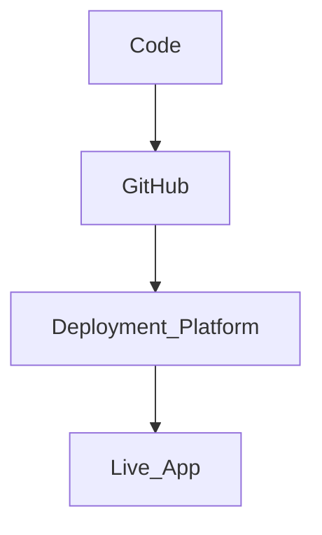

# Deployment Providers Integration Guide

This guide helps you deploy the project using popular platforms. No prior setup assumed.

> ⚠️ Note: This guide primarily covers frontend deployment. Backend services (Node.js, MongoDB, Redis) should be deployed separately using platforms like Render, Railway, or similar.

---

## 🌐 Overview

Supported providers:

* Cloudflare Pages
* GitHub Pages
* Netlify
* Vercel

Each section includes:

* Account setup
* Configuration
* Environment variables
* API token (if required)
* Testing & validation
* Troubleshooting

---

## 🔁 Deployment Flow



---

# ☁️ Cloudflare Pages

## 1. Account Setup

* Go to https://dash.cloudflare.com
* Create an account and log in

## 2. Create Project

* Go to **Pages → Create Project**
* Connect your GitHub repository

## 3. Build Settings

* Framework preset: None / Vite
* Build command:

```bash
npm run build
```

* Output directory:

```text
dist
```

## 4. API Token (Optional)

* Go to **My Profile → API Tokens**
* Create a token if using advanced integrations
* Keep it secure

## 5. Environment Variables

```bash
VITE_API_URL=https://your-backend-url
```

## 6. Deploy

* Click **Deploy**
* Wait for build completion

## 7. Integration Testing

* Open deployed URL
* Verify UI loads correctly
* Check API calls in browser network tab
* Ensure environment variables are working

## ⚠️ Troubleshooting

* Build fails → check Node version
* Blank page → incorrect build folder
* API issues → incorrect environment variable

---

# 🐙 GitHub Pages

## 1. Setup

* Go to repository → Settings → Pages
* Select branch: `main` or `gh-pages`

## 2. Build

```bash
npm run build
```

## 3. Deploy

Install:

```bash
npm install gh-pages --save-dev
```

Add in `package.json`:

```json
"scripts": {
  "deploy": "gh-pages -d dist"
}
```

Run:

```bash
npm run deploy
```

## 4. API Token / Access

* Uses your GitHub account permissions
* Ensure repo has proper access

## 5. Integration Testing

* Open deployed site
* Refresh routes to check SPA behavior
* Verify assets load correctly

## ⚠️ Troubleshooting

* 404 on refresh → SPA routing issue
* Assets not loading → incorrect base path

---

# 🌍 Netlify

## 1. Setup

* Go to https://netlify.com
* Login and connect GitHub

## 2. Create Site

* Click **Add new site → Import from Git**

## 3. Build Settings

* Build command:

```bash
npm run build
```

* Publish directory:

```text
dist
```

## 4. API Token (Optional)

* Go to **User Settings → Applications → Personal Access Tokens**
* Generate token if needed for automation

## 5. Environment Variables

```bash
VITE_API_URL=https://your-backend-url
```

## 6. Deploy

* Click **Deploy site**

## 7. Integration Testing

* Verify deployed URL
* Check environment variables applied
* Inspect console for errors

## ⚠️ Troubleshooting

* Build fails → missing dependencies
* Env vars not working → redeploy after adding

---

# ⚡ Vercel

## 1. Setup

* Go to https://vercel.com
* Import GitHub project

## 2. Configure

* Framework: Vite / React
* Usually auto-detected

## 3. API Token (Optional)

* Go to **Settings → Tokens**
* Generate token if using CLI or automation

## 4. Environment Variables

```bash
VITE_API_URL=https://your-backend-url
```

## 5. Deploy

* Click **Deploy**

## 6. Integration Testing

* Open deployed app
* Verify API connectivity
* Check logs for build/runtime issues

## ⚠️ Troubleshooting

* API errors → incorrect backend URL
* Build issues → check logs

---

# 📸 Screenshots (Optional)

You can include dashboard screenshots for each provider to improve clarity for beginners.

---

# ✅ Final Checklist

* App loads correctly
* API calls working
* Environment variables configured
* No console errors

---

# 🎯 Notes

* Do not expose backend secrets publicly
* Always verify environment variables
* Use HTTPS URLs for production
