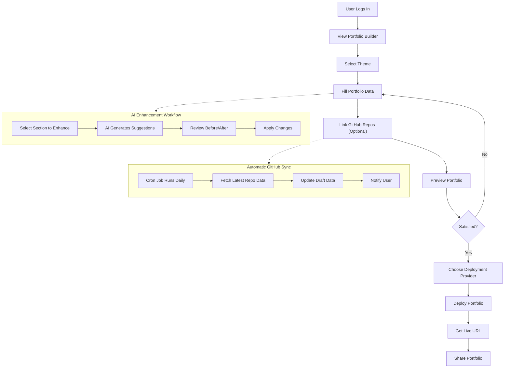
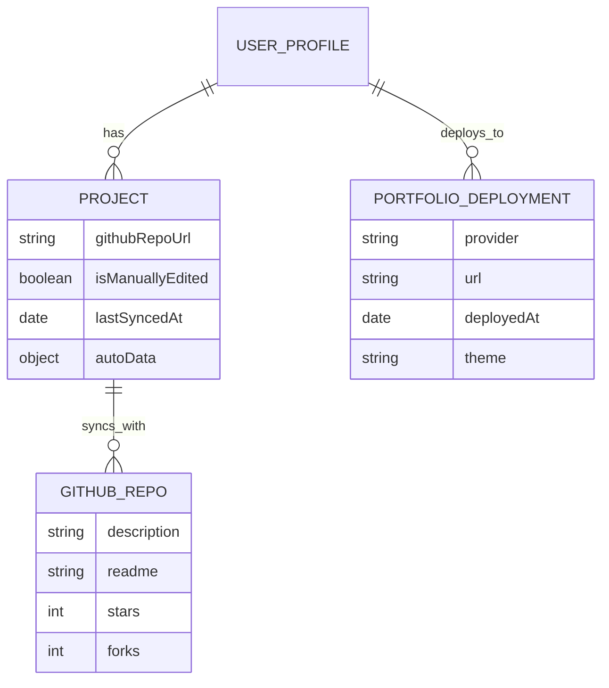
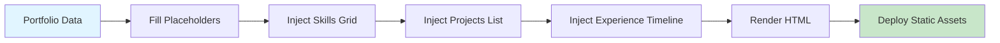
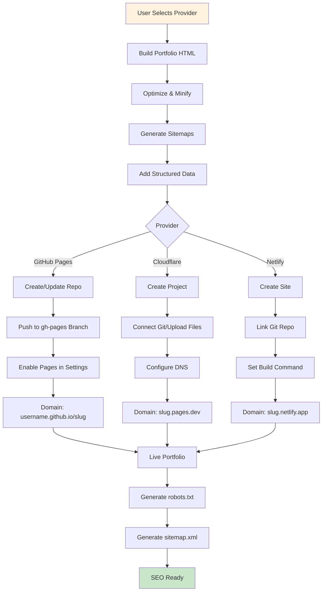
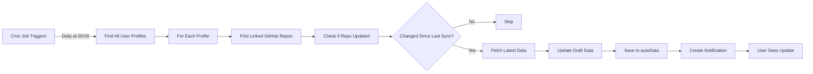

# 🎨 Portfolio Feature Architecture

**Last Updated**: May 2026  
**Audience**: Developers and Contributors  
**Status**: Active Development

---

## Table of Contents

1. [Feature Overview](#feature-overview)
2. [User Flow](#user-flow)
3. [Data Models](#data-models)
4. [Template Engine](#template-engine)
5. [Deployment Architecture](#deployment-architecture)
6. [API Endpoints](#api-endpoints)
7. [Adding a New Theme](#adding-a-new-theme)
8. [Adding a New Deploy Provider](#adding-a-new-deploy-provider)

---

## Feature Overview

The **Portfolio Feature** enables users to showcase their professional work through custom, deployable portfolio websites. It integrates with multiple themes, supports one-click deployment to major cloud providers, and includes AI-powered content enhancement.

### Key Features

- **Multi-Theme Support**: Pre-built, responsive portfolio templates (4 themes)
- **GitHub Project Sync**: Automatic sync of GitHub repository data (daily via cron job)
- **AI Content Enhancement**: Enhance portfolio sections (hero, projects, about, skills) using AI
- **One-Click Deployment**: Deploy to GitHub Pages, Cloudflare Pages, or Netlify
- **SEO Optimization**: Auto-generated sitemaps, robots.txt, and structured data (Schema.org)
- **Performance Tracking**: Bandwidth monitoring and portfolio analytics
- **Custom Domains**: Support for custom domain mapping

---

## User Flow



---

## Data Models

### UserProfile Schema

The `UserProfile` model stores portfolio content and configuration:

```javascript
{
  uid: String,                    // Firebase UID (indexed)
  displayName: String,            // Portfolio owner name
  bio: String,                    // Short bio (max 500 chars)
  jobRole: String,                // Current role/title
  skills: [String],               // Array of skill tags
  location: String,               // Geographic location
  website: String,                // Personal website URL
  github: String,                 // GitHub profile URL
  linkedin: String,               // LinkedIn profile URL
  projects: [{
    githubRepoUrl: String,        // Linked GitHub repo
    isManuallyEdited: Boolean,    // User has customized
    lastSyncedAt: Date,           // Last sync timestamp
    autoData: {
      description: String,        // Auto-fetched from GitHub
      readme: String              // Auto-fetched README.md
    }
  }],
  timestamps: true                // createdAt, updatedAt
}
```

### Data Model Diagram



### Portfolio File Structure

Each deployed portfolio is generated from a **theme template** stored in the backend:

```
backend/src/templates/portfolio/
├── _starter/                    # Minimal starter template
│   ├── index.html              # Handlebars-based template
│   ├── style.css               # Base styles
│   └── script.js               # Template data structure
├── stripe-gradient/             # Gradient design theme
│   ├── index.html
│   ├── style.css
│   └── script.js
├── vercel-mono/                 # Monospace, minimalist theme
│   ├── index.html
│   ├── style.css
│   └── script.js
└── retro-pixel/                 # Pixel art retro theme
    ├── index.html
    ├── style.css
    └── script.js
```

---

## Template Engine

### Architecture

The template engine uses **placeholder replacement** combined with **DOM injection** for dynamic content:



### Placeholder System

The engine replaces **template variables** throughout the HTML document:

#### Common Placeholders

| Placeholder | Source | Example |
|------------|--------|---------|
| `{{NAME}}` | `displayName` | "Sarah Chen" |
| `{{ROLE}}` | `jobRole` | "Full-Stack Engineer" |
| `{{TAGLINE}}` | Custom input | "Building with React & Node.js" |
| `{{INITIALS}}` | Derived from name | "SC" |
| `{{ABOUT_PARA_1}}` | User input | Bio paragraph |
| `{{STAT_1}}`, `{{STAT_2}}`, `{{STAT_3}}` | Analytics | "5+ Years Exp", "40+ Projects" |
| `{{GITHUB_URL}}`, `{{LINKEDIN_URL}}` | Social links | Profile URLs |

#### Placeholder Replacement Flow

```javascript
// 1. Walk document tree
const walker = document.createTreeWalker(
  document.documentElement, 
  NodeFilter.SHOW_TEXT
);

// 2. Replace in text nodes
while (walker.nextNode()) {
  let val = node.nodeValue;
  Object.entries(PLACEHOLDER_MAP).forEach(([p, r]) => {
    val = val.split(p).join(r);
  });
}

// 3. Replace in attributes (href, src, content, aria-label, title, alt)
document.querySelectorAll('[href], [src], [content], [aria-label]').forEach(el => {
  const attr = el.getAttribute('href'); // etc.
  // Apply same replacement logic
});

// 4. XSS Protection: Sanitize href attributes
const sanitizeHref = (value) => {
  try {
    const url = new URL(value, window.location.origin);
    if (!['http:', 'https:', 'mailto:'].includes(url.protocol)) return '#';
    return value;
  } catch (e) {
    return '#';
  }
};
```

### DOM Injection for Dynamic Sections

For arrays (skills, projects, experience), the template uses **JavaScript DOM builders**:

```javascript
// Example: Build skills grid
const buildSkills = () => {
  const grid = document.getElementById('skills-grid');
  PORTFOLIO.skillCategories.forEach((category) => {
    const section = document.createElement('div');
    section.className = 'skill-category';
    
    category.skills.forEach((skill) => {
      const bar = document.createElement('div');
      bar.className = 'skill-bar';
      bar.innerHTML = `
        <label>${skill.name}</label>
        <div class="progress">
          <div class="fill" style="width: ${skill.pct}%"></div>
        </div>
      `;
      section.appendChild(bar);
    });
    grid.appendChild(section);
  });
};
```

### Structured Data Generation

For SEO, the engine generates **Schema.org structured data**:

```javascript
// Person schema
{
  "@context": "https://schema.org",
  "@type": "Person",
  "name": "{{NAME}}",
  "jobTitle": "{{ROLE}}",
  "url": "https://portfolio-slug.example.com",
  "sameAs": [
    "https://github.com/username",
    "https://linkedin.com/in/username"
  ]
}

// WebSite schema
{
  "@context": "https://schema.org",
  "@type": "WebSite",
  "name": "{{NAME}}'s Portfolio",
  "url": "https://portfolio-slug.example.com"
}

// ItemList schema (for projects)
{
  "@context": "https://schema.org",
  "@type": "ItemList",
  "itemListElement": [
    { "@type": "ListItem", "position": 1, "name": "Project Name", "url": "..." }
  ]
}
```

---

## Deployment Architecture

### Supported Providers

| Provider | Region | Free Tier | CDN | Custom Domain | Notes |
|----------|--------|-----------|-----|---------------|-------|
| **GitHub Pages** | Global | 2GB/month | Via GitHub | ✅ | Best for developers |
| **Cloudflare Pages** | Global | 500 deploys/month | ✅ Native | ✅ | Recommended: Fast + Free |
| **Netlify** | Global | 300 build min/month | ✅ Native | ✅ | Feature-rich serverless |

### Deployment Flow Diagram



### Provider-Specific Implementation Details

#### GitHub Pages

```javascript
// GitHub provider flow
const deployToGitHub = async (portfolioSlug, htmlContent) => {
  // 1. Authenticate with GitHub token
  const octokit = new Octokit({ auth: process.env.GITHUB_TOKEN });
  
  // 2. Create/Get repository
  const repo = await octokit.repos.createOrUpdate({
    owner: username,
    repo: `${username}.github.io`,
    private: false,
    auto_init: true
  });
  
  // 3. Commit HTML to gh-pages branch
  await octokit.repos.createOrUpdateFileContents({
    owner: username,
    repo: `${username}.github.io`,
    path: `${portfolioSlug}/index.html`,
    message: `Deploy portfolio: ${portfolioSlug}`,
    content: Buffer.from(htmlContent).toString('base64'),
    branch: 'gh-pages'
  });
  
  // 4. Return live URL
  return `https://${username}.github.io/${portfolioSlug}`;
};
```

#### Cloudflare Pages

```javascript
// Cloudflare provider flow
const deployToCloudflare = async (portfolioSlug, htmlContent) => {
  // 1. Create Pages project
  const project = await fetch('https://api.cloudflare.com/client/v4/accounts/{account}/pages/projects', {
    method: 'POST',
    headers: { 'Authorization': `Bearer ${CLOUDFLARE_TOKEN}` },
    body: JSON.stringify({
      name: portfolioSlug,
      production_branch: 'main'
    })
  });
  
  // 2. Upload static assets to R2 bucket (Cloudflare's object storage)
  // OR directly push to git integration
  
  // 3. Return live URL
  return `https://${portfolioSlug}.pages.dev`;
};
```

#### Netlify

```javascript
// Netlify provider flow
const deployToNetlify = async (portfolioSlug, htmlContent) => {
  // 1. Create site
  const site = await fetch('https://api.netlify.com/api/v1/sites', {
    method: 'POST',
    headers: { 'Authorization': `Bearer ${NETLIFY_TOKEN}` },
    body: JSON.stringify({
      name: portfolioSlug,
      custom_domain: null
    })
  });
  
  // 2. Deploy files
  const deployment = await fetch(`${site.url}/deploys`, {
    method: 'POST',
    headers: { 'Authorization': `Bearer ${NETLIFY_TOKEN}` },
    body: formData // multipart file upload
  });
  
  // 3. Return live URL
  return `https://${portfolioSlug}.netlify.app`;
};
```

### SEO & Performance Features

#### Auto-Generated Sitemaps

```xml
<?xml version="1.0" encoding="UTF-8"?>
<urlset xmlns="http://www.sitemaps.org/schemas/sitemap/0.9">
  <url>
    <loc>https://slug.example.com/</loc>
    <lastmod>2026-05-20</lastmod>
    <changefreq>weekly</changefreq>
    <priority>1.0</priority>
  </url>
  <url>
    <loc>https://slug.example.com/projects/project-1</loc>
    <lastmod>2026-05-18</lastmod>
    <changefreq>monthly</changefreq>
    <priority>0.8</priority>
  </url>
</urlset>
```

#### Robots.txt Generation

```
User-agent: *
Allow: /

Sitemap: https://slug.example.com/sitemap.xml
```

#### Bandwidth Monitoring

```javascript
// API endpoint: GET /api/portfolio/:id/bandwidth
{
  "slug": "my-portfolio",
  "estimatedPageSizeKB": 500,
  "monthlyViews": 1200,
  "bandwidthUsageMB": 585.94,
  "freeTierLimitMB": 102400,
  "usagePercentage": 0.57,
  "warning": false
}
```

---

## API Endpoints

For complete API documentation, see [API_DOCS/portfolio.md](../API_DOCS/portfolio.md).

### Key Endpoints

#### Deployment Endpoints

| Method | Endpoint | Description |
|--------|----------|-------------|
| `POST` | `/api/portfolio/deploy` | Trigger deployment to selected provider |
| `GET` | `/api/portfolio/:id/deployment-status` | Check deployment status |
| `GET` | `/api/portfolio/:id/bandwidth` | Get bandwidth usage metrics |

#### Content Enhancement Endpoints

| Method | Endpoint | Description |
|--------|----------|-------------|
| `POST` | `/api/portfolio/enhance-portfolio-content` | Get AI suggestions for a section |
| `POST` | `/api/portfolio/:id/performance` | Track portfolio performance metrics |

#### SEO Endpoints

| Method | Endpoint | Description |
|--------|----------|-------------|
| `GET` | `/api/portfolio/public/:slug/sitemap.xml` | XML sitemap for search engines |
| `GET` | `/api/portfolio/public/:slug/robots.txt` | Robots.txt file |

#### Theme Preview Endpoints

| Method | Endpoint | Description |
|--------|----------|-------------|
| `GET` | `/api/portfolio/themes` | List all available themes |
| `GET` | `/api/portfolio/themes/:name/preview` | Get preview data for a theme |

### Example: Enhance Portfolio Content

**Request:**
```bash
curl -X POST http://localhost:5000/api/portfolio/enhance-portfolio-content \
  -H "Authorization: Bearer <token>" \
  -H "Content-Type: application/json" \
  -d '{
    "sectionType": "hero",
    "content": {
      "title": "I am a developer",
      "bio": "I like coding",
      "tagline": "I make websites"
    }
  }'
```

**Response:**
```json
{
  "success": true,
  "message": "Enhancement suggestion generated. Review before applying.",
  "data": {
    "sectionType": "hero",
    "before": {
      "title": "I am a developer",
      "bio": "I like coding",
      "tagline": "I make websites"
    },
    "after": {
      "title": "Full-Stack Developer & Creative Builder",
      "bio": "Passionate about crafting elegant solutions to complex problems. I specialize in building scalable web applications with modern technologies.",
      "tagline": "Turning ideas into impactful digital experiences through code and design."
    },
    "improvements": [
      "Made title more compelling and distinctive",
      "Expanded bio to showcase expertise and passion",
      "Enhanced tagline with concrete value proposition"
    ]
  }
}
```

---

## GitHub Project Sync

### How It Works

The portfolio feature includes **automatic GitHub synchronization** that runs daily via cron job.



### Implementation

**File**: `backend/src/services/portfolioGitHubSync.js`

```javascript
export const syncGithubProjects = async () => {
  // 1. Find all user profiles with linked GitHub repos
  const userProfiles = await UserProfile.find({
    'projects.githubRepoUrl': { $exists: true, $ne: null }
  });

  for (const profile of userProfiles) {
    for (const project of profile.projects) {
      if (!project.githubRepoUrl) continue;

      // 2. Parse GitHub URL
      const { owner, repo } = parseGithubUrl(project.githubRepoUrl);

      try {
        // 3. Fetch latest repo data
        const repoData = await axios.get(
          `https://api.github.com/repos/${owner}/${repo}`,
          { headers: { Authorization: `token ${GITHUB_TOKEN}` } }
        );

        // 4. Check if updated since last sync
        const repoUpdatedAt = new Date(repoData.updated_at);
        const lastSyncedAt = new Date(project.lastSyncedAt || 0);

        if (repoUpdatedAt > lastSyncedAt && !project.isManuallyEdited) {
          // 5. Update ONLY draft data (not user's custom content)
          project.autoData.description = repoData.description;
          
          // 6. Fetch README
          try {
            const readme = await axios.get(
              `https://api.github.com/repos/${owner}/${repo}/readme`,
              { headers: { Authorization: `token ${GITHUB_TOKEN}` } }
            );
            project.autoData.readme = Buffer.from(
              readme.data.content, 
              'base64'
            ).toString('utf-8');
          } catch (e) {
            // No README found
          }

          project.lastSyncedAt = new Date();
          await profile.save();

          // 7. Notify user
          await NotificationLog.create({
            userId: profile.uid,
            type: 'PORTFOLIO_SYNC',
            title: 'GitHub Projects Synced',
            message: `Updated draft data for ${updatedProjectsCount} projects.`
          });
        }
      } catch (error) {
        console.error(`Sync failed for ${project.githubRepoUrl}: ${error.message}`);
      }
    }
  }
};

// Initialize cron job
export const initGitHubSyncCron = () => {
  cron.schedule('0 0 * * *', () => {
    syncGithubProjects(); // Runs daily at midnight
  });
};
```

### Key Design Principles

1. **Never Overwrite User Content**: Only update `autoData`, not user's custom fields
2. **No Forced Redeploy**: Sync saves to DB only, user must manually redeploy
3. **User Notifications**: Email/in-app notification when updates are found
4. **Safe Failure**: Individual repo failures don't stop the entire job
5. **Rate Limiting**: Respects GitHub API rate limits with conditional tokens

---

## Adding a New Theme

### Step 1: Create Theme Directory

Create a new folder in `backend/src/templates/portfolio/`:

```bash
mkdir backend/src/templates/portfolio/my-theme
cd backend/src/templates/portfolio/my-theme
```

### Step 2: Create Template Files

Create three essential files:

#### `index.html` - Main Template

```html
<!DOCTYPE html>
<html lang="en">
<head>
  <meta charset="UTF-8">
  <meta name="viewport" content="width=device-width, initial-scale=1.0">
  
  <!-- SEO Meta Tags -->
  <title>{{NAME}} — Portfolio</title>
  <meta name="description" content="{{NAME}}'s portfolio" />
  <meta property="og:title" content="{{NAME}} — Portfolio" />
  <meta property="og:type" content="website" />
  
  <!-- Link to styles -->
  <link rel="stylesheet" href="style.css" />
</head>
<body>
  <!-- Navigation -->
  <nav id="navbar">
    <a href="#hero" class="logo">{{INITIALS}}</a>
    <ul class="nav-links">
      <li><a href="#about">About</a></li>
      <li><a href="#projects">Projects</a></li>
      <li><a href="#contact">Contact</a></li>
    </ul>
  </nav>

  <!-- Hero Section -->
  <section id="hero">
    <h1>{{NAME}}</h1>
    <p>{{ROLE}}</p>
    <p>{{TAGLINE}}</p>
  </section>

  <!-- About Section -->
  <section id="about">
    <h2>About Me</h2>
    <p>{{ABOUT_PARA_1}}</p>
    <p>{{ABOUT_PARA_2}}</p>
  </section>

  <!-- Projects Section -->
  <section id="projects">
    <h2>Projects</h2>
    <div id="projects-grid"></div>
  </section>

  <!-- Skills Section -->
  <section id="skills">
    <h2>Skills</h2>
    <div id="skills-grid"></div>
  </section>

  <!-- Experience Section -->
  <section id="experience">
    <h2>Experience</h2>
    <div id="timeline"></div>
  </section>

  <!-- Contact Section -->
  <section id="contact">
    <h2>Get in Touch</h2>
    <a href="mailto:{{EMAIL}}">Email Me</a>
  </section>

  <!-- Scripts -->
  <script src="script.js"></script>
</body>
</html>
```

#### `style.css` - Theme Styles

```css
/* Define your theme CSS here */
:root {
  --primary: #3b82f6;
  --secondary: #1f2937;
  --background: #ffffff;
  --text: #111827;
}

* {
  margin: 0;
  padding: 0;
  box-sizing: border-box;
}

body {
  font-family: 'Segoe UI', Tahoma, Geneva, Verdana, sans-serif;
  background-color: var(--background);
  color: var(--text);
  line-height: 1.6;
}

#navbar {
  position: sticky;
  top: 0;
  background: var(--secondary);
  color: white;
  padding: 1rem 2rem;
  display: flex;
  justify-content: space-between;
  align-items: center;
  z-index: 100;
}

.nav-links {
  display: flex;
  gap: 2rem;
  list-style: none;
}

.nav-links a {
  color: white;
  text-decoration: none;
  transition: opacity 0.3s;
}

.nav-links a:hover {
  opacity: 0.7;
}

#hero {
  min-height: 100vh;
  display: flex;
  flex-direction: column;
  justify-content: center;
  align-items: center;
  text-align: center;
  padding: 2rem;
  background: linear-gradient(135deg, var(--primary), var(--secondary));
  color: white;
}

#hero h1 {
  font-size: 3.5rem;
  margin-bottom: 1rem;
  animation: fadeInUp 1s ease-out;
}

#hero p {
  font-size: 1.25rem;
  margin: 0.5rem 0;
}

/* Responsive Grid */
.grid {
  display: grid;
  grid-template-columns: repeat(auto-fit, minmax(300px, 1fr));
  gap: 2rem;
  padding: 2rem;
}

@keyframes fadeInUp {
  from {
    opacity: 0;
    transform: translateY(30px);
  }
  to {
    opacity: 1;
    transform: translateY(0);
  }
}

@media (max-width: 768px) {
  #navbar {
    flex-direction: column;
    gap: 1rem;
  }
  
  .nav-links {
    gap: 1rem;
  }
  
  #hero h1 {
    font-size: 2rem;
  }
}
```

#### `script.js` - Theme Logic

```javascript
/**
 * Theme-specific portfolio data and DOM injection
 * This is where you handle:
 * 1. Placeholder replacement
 * 2. DOM injection for arrays (projects, skills, experience)
 * 3. Event listeners and interactions
 */

'use strict';

// Portfolio data structure (matches backend UserProfile)
const PORTFOLIO = {
  name: 'ALEX DEV',
  initials: 'AD',
  role: 'SOFTWARE ENGINEER',
  tagline: 'Building scalable web applications',
  email: 'alex@example.com',
  about1: 'I am a full-stack developer...',
  about2: 'When I am not coding...',
  
  skillCategories: [
    {
      title: 'Frontend',
      skills: [
        { name: 'React', pct: 95 },
        { name: 'TypeScript', pct: 90 }
      ]
    }
  ],
  
  projects: [
    {
      id: '01',
      title: 'Project Name',
      desc: 'Project description',
      tags: ['React', 'Node.js'],
      demo: 'https://demo.example.com',
      code: 'https://github.com/example'
    }
  ],
  
  experience: [
    {
      date: '2022 — Present',
      role: 'Senior Engineer',
      company: 'TechFlow',
      desc: 'Leading engineering team...'
    }
  ]
};

// Helper: Create DOM element
const el = (tag, classes = [], attrs = {}) => {
  const node = document.createElement(tag);
  if (classes.length) node.className = classes.join(' ');
  Object.entries(attrs).forEach(([k, v]) => node.setAttribute(k, v));
  return node;
};

// Step 1: Fill placeholders in HTML
const fillPlaceholders = () => {
  const map = {
    '{{NAME}}': PORTFOLIO.name,
    '{{INITIALS}}': PORTFOLIO.initials,
    '{{ROLE}}': PORTFOLIO.role,
    '{{TAGLINE}}': PORTFOLIO.tagline,
    '{{EMAIL}}': PORTFOLIO.email,
    '{{ABOUT_PARA_1}}': PORTFOLIO.about1,
    '{{ABOUT_PARA_2}}': PORTFOLIO.about2,
  };

  // Replace in text nodes
  const walker = document.createTreeWalker(
    document.documentElement,
    NodeFilter.SHOW_TEXT
  );
  
  const textNodes = [];
  while (walker.nextNode()) textNodes.push(walker.currentNode);

  textNodes.forEach((node) => {
    let val = node.nodeValue;
    Object.entries(map).forEach(([p, r]) => {
      val = val.split(p).join(r);
    });
    node.nodeValue = val;
  });

  // Replace in attributes
  document.querySelectorAll('[href], [src], [content], [aria-label], [title], [alt]').forEach((el) => {
    ['href', 'src', 'content', 'aria-label', 'title', 'alt'].forEach((attr) => {
      const val = el.getAttribute(attr);
      if (!val) return;
      
      let newVal = val;
      Object.entries(map).forEach(([p, r]) => {
        newVal = newVal.split(p).join(r);
      });

      if (attr === 'href') {
        newVal = sanitizeHref(newVal);
      }
      
      el.setAttribute(attr, newVal);
    });
  });
};

// Step 2: Inject projects grid
const buildProjects = () => {
  const grid = document.getElementById('projects-grid');
  if (!grid) return;

  PORTFOLIO.projects.forEach((project) => {
    const card = el('div', ['project-card']);
    card.innerHTML = `
      <h3>${project.title}</h3>
      <p>${project.desc}</p>
      <div class="tags">
        ${project.tags.map(t => `<span class="tag">${t}</span>`).join('')}
      </div>
      <div class="links">
        <a href="${project.demo}" target="_blank">Demo</a>
        <a href="${project.code}" target="_blank">Code</a>
      </div>
    `;
    grid.appendChild(card);
  });
};

// Step 3: Inject skills grid
const buildSkills = () => {
  const grid = document.getElementById('skills-grid');
  if (!grid) return;

  PORTFOLIO.skillCategories.forEach((category) => {
    const section = el('div', ['skill-section']);
    section.innerHTML = `<h3>${category.title}</h3>`;
    
    const skillsContainer = el('div', ['skills-container']);
    category.skills.forEach((skill) => {
      const bar = el('div', ['skill-bar']);
      bar.innerHTML = `
        <label>${skill.name}</label>
        <div class="progress">
          <div class="fill" style="width: ${skill.pct}%"></div>
        </div>
      `;
      skillsContainer.appendChild(bar);
    });
    
    section.appendChild(skillsContainer);
    grid.appendChild(section);
  });
};

// Step 4: Inject experience timeline
const buildExperience = () => {
  const timeline = document.getElementById('timeline');
  if (!timeline) return;

  PORTFOLIO.experience.forEach((exp) => {
    const item = el('div', ['timeline-item']);
    item.innerHTML = `
      <div class="date">${exp.date}</div>
      <div class="content">
        <h3>${exp.role}</h3>
        <p class="company">${exp.company}</p>
        <p>${exp.desc}</p>
      </div>
    `;
    timeline.appendChild(item);
  });
};

// Initialize on DOM ready
document.addEventListener('DOMContentLoaded', () => {
  fillPlaceholders();
  buildProjects();
  buildSkills();
  buildExperience();
});
```

### Step 3: Register Theme in Backend

Update `backend/src/config/portfolio.js` (create if missing):

```javascript
export const AVAILABLE_THEMES = [
  {
    id: 'stripe-gradient',
    name: 'Stripe Gradient',
    description: 'Modern gradient design with smooth animations',
    thumbnail: '/themes/stripe-gradient-thumb.png'
  },
  {
    id: 'vercel-mono',
    name: 'Vercel Mono',
    description: 'Monospace, minimalist design inspired by Vercel',
    thumbnail: '/themes/vercel-mono-thumb.png'
  },
  {
    id: 'retro-pixel',
    name: 'Retro Pixel',
    description: 'Nostalgic pixel art theme',
    thumbnail: '/themes/retro-pixel-thumb.png'
  },
  {
    id: 'my-theme',        // ← Add your theme
    name: 'My Theme',
    description: 'Custom theme description',
    thumbnail: '/themes/my-theme-thumb.png'
  }
];
```

### Step 4: Add Theme to Frontend

In `frontend/src/components/portfolio/ThemeSelector.jsx`:

```jsx
const THEMES = [
  { id: 'stripe-gradient', name: 'Stripe Gradient', icon: '✨' },
  { id: 'vercel-mono', name: 'Vercel Mono', icon: '▮' },
  { id: 'retro-pixel', name: 'Retro Pixel', icon: '🎮' },
  { id: 'my-theme', name: 'My Theme', icon: '🎨' },  // ← Add here
];

// Theme selector component will auto-render
```

### Step 5: Testing

```bash
# 1. Start backend
cd backend
npm run dev

# 2. Navigate to theme in browser
http://localhost:5000/templates/portfolio/my-theme/index.html

# 3. Check that all placeholders are replaced
# 4. Test projects, skills, experience rendering
# 5. Test responsive design
```

### Theme Checklist

- [ ] Create `index.html` with proper placeholder syntax
- [ ] Create `style.css` with responsive design
- [ ] Create `script.js` with DOM injection logic
- [ ] Test all placeholders are replaced
- [ ] Test grid/list rendering for arrays
- [ ] Test on mobile devices
- [ ] Ensure all links are sanitized
- [ ] Register theme in backend config
- [ ] Add to frontend theme selector
- [ ] Add thumbnail preview (640x480px PNG)

---

## Adding a New Deploy Provider

### Architecture Overview

Adding a new provider requires:

1. **Backend deployment logic** (`services/deploymentProviders/`)
2. **Frontend provider UI** (`components/portfolio/DeployModal.jsx`)
3. **Configuration & authentication** (environment variables)

### Step 1: Create Backend Provider Service

Create `backend/src/services/deploymentProviders/your-provider.js`:

```javascript
/**
 * Your Cloud Provider Deployment Service
 * 
 * Interface Requirements:
 * - async deploy(portfolioData, htmlContent): Promise<{ url, provider, deployedAt }>
 * - validateAuth(): Promise<boolean>
 * - getStatus(deploymentId): Promise<DeploymentStatus>
 */

export class YourProviderDeployer {
  constructor(apiKey, apiSecret) {
    this.apiKey = apiKey;
    this.apiSecret = apiSecret;
    this.baseUrl = 'https://api.your-provider.com/v1';
  }

  /**
   * Deploy portfolio to Your Provider
   * @param {Object} portfolioData - User's portfolio content
   * @param {string} htmlContent - Compiled HTML
   * @returns {Promise<{url: string, provider: string, deployedAt: Date}>}
   */
  async deploy(portfolioData, htmlContent) {
    try {
      // 1. Validate authentication
      await this.validateAuth();

      // 2. Create/update project
      const projectName = this.sanitizeProjectName(portfolioData.slug);
      const project = await this.createProject(projectName);

      // 3. Minify and prepare assets
      const assets = {
        'index.html': htmlContent,
        // Include other files: CSS, JS, images
      };

      // 4. Upload assets
      const uploadResult = await this.uploadAssets(project.id, assets);

      // 5. Trigger deployment
      const deployment = await this.triggerBuild(project.id);

      // 6. Wait for deployment to complete
      const finalUrl = await this.waitForDeployment(deployment.id);

      // 7. Return deployment info
      return {
        url: finalUrl,
        provider: 'your-provider',
        deployedAt: new Date(),
        projectId: project.id,
        deploymentId: deployment.id
      };
    } catch (error) {
      throw new Error(`Deployment to Your Provider failed: ${error.message}`);
    }
  }

  /**
   * Validate API credentials
   */
  async validateAuth() {
    const response = await fetch(`${this.baseUrl}/account/validate`, {
      headers: this.getAuthHeaders()
    });

    if (!response.ok) {
      throw new Error('Invalid API credentials');
    }

    return true;
  }

  /**
   * Get deployment status
   */
  async getStatus(deploymentId) {
    const response = await fetch(
      `${this.baseUrl}/deployments/${deploymentId}`,
      { headers: this.getAuthHeaders() }
    );

    const data = await response.json();
    return {
      id: data.id,
      status: data.status, // 'pending' | 'building' | 'deployed' | 'failed'
      url: data.url,
      error: data.error_message
    };
  }

  /**
   * Create project/site
   */
  async createProject(name) {
    const response = await fetch(`${this.baseUrl}/projects`, {
      method: 'POST',
      headers: this.getAuthHeaders(),
      body: JSON.stringify({
        name,
        description: 'Portfolio powered by Career Pilot'
      })
    });

    if (!response.ok) throw new Error('Failed to create project');
    return response.json();
  }

  /**
   * Upload HTML and assets
   */
  async uploadAssets(projectId, assets) {
    const formData = new FormData();
    
    for (const [filename, content] of Object.entries(assets)) {
      const blob = new Blob([content], {
        type: filename.endsWith('.html') ? 'text/html' : 'text/plain'
      });
      formData.append('files', blob, filename);
    }

    const response = await fetch(
      `${this.baseUrl}/projects/${projectId}/files`,
      {
        method: 'POST',
        headers: this.getAuthHeaders(),
        body: formData
      }
    );

    if (!response.ok) throw new Error('Failed to upload assets');
    return response.json();
  }

  /**
   * Trigger build and deployment
   */
  async triggerBuild(projectId) {
    const response = await fetch(
      `${this.baseUrl}/projects/${projectId}/builds`,
      {
        method: 'POST',
        headers: this.getAuthHeaders(),
        body: JSON.stringify({ branch: 'main' })
      }
    );

    if (!response.ok) throw new Error('Failed to trigger build');
    return response.json();
  }

  /**
   * Poll for deployment completion
   */
  async waitForDeployment(deploymentId, maxWait = 300000) {
    const startTime = Date.now();
    
    while (Date.now() - startTime < maxWait) {
      const status = await this.getStatus(deploymentId);

      if (status.status === 'deployed') {
        return status.url;
      } else if (status.status === 'failed') {
        throw new Error(`Deployment failed: ${status.error}`);
      }

      // Wait 5 seconds before checking again
      await new Promise(resolve => setTimeout(resolve, 5000));
    }

    throw new Error('Deployment timeout');
  }

  /**
   * Sanitize project name for provider constraints
   */
  sanitizeProjectName(slug) {
    // Most providers require: alphanumeric + hyphens, 3-50 chars
    return slug
      .toLowerCase()
      .replace(/[^a-z0-9-]/g, '-')
      .replace(/-+/g, '-')
      .replace(/^-|-$/g, '')
      .substring(0, 50);
  }

  /**
   * Get common auth headers
   */
  getAuthHeaders() {
    return {
      'Authorization': `Bearer ${this.apiKey}`,
      'Content-Type': 'application/json',
      'User-Agent': 'career-pilot-portfolio-deployer/1.0'
    };
  }
}
```

### Step 2: Create Backend Route Handler

Update `backend/src/routes/portfolio.js`:

```javascript
import { YourProviderDeployer } from '../services/deploymentProviders/your-provider.js';

/**
 * POST /api/portfolio/deploy
 * Deploy portfolio to selected provider
 */
router.post('/deploy', verifyToken, asyncHandler(async (req, res) => {
  const { provider, portfolioSlug, theme } = req.body;
  
  if (!['github', 'cloudflare', 'netlify', 'your-provider'].includes(provider)) {
    throw new ApiError(400, 'Invalid provider');
  }

  // Get user's portfolio data
  const portfolio = await UserProfile.findOne({ uid: req.userId });
  if (!portfolio) throw new ApiError(404, 'Portfolio not found');

  // Compile HTML from theme + portfolio data
  const html = await compilePortfolioHTML(theme, portfolio);

  try {
    let deploymentResult;

    switch (provider) {
      case 'github':
        deploymentResult = await deployToGitHub(html, portfolioSlug);
        break;
      case 'cloudflare':
        deploymentResult = await deployToCloudflare(html, portfolioSlug);
        break;
      case 'netlify':
        deploymentResult = await deployToNetlify(html, portfolioSlug);
        break;
      case 'your-provider':  // ← Add here
        const deployer = new YourProviderDeployer(
          process.env.YOUR_PROVIDER_API_KEY,
          process.env.YOUR_PROVIDER_API_SECRET
        );
        deploymentResult = await deployer.deploy(portfolio, html);
        break;
    }

    // Save deployment record
    await PortfolioDeployment.create({
      userId: req.userId,
      provider,
      url: deploymentResult.url,
      theme,
      deployedAt: new Date()
    });

    res.status(200).json({
      success: true,
      message: 'Portfolio deployed successfully',
      data: {
        url: deploymentResult.url,
        provider,
        deployedAt: new Date()
      }
    });
  } catch (error) {
    throw new ApiError(500, `Deployment failed: ${error.message}`);
  }
}));
```

### Step 3: Update Frontend Provider List

Edit `frontend/src/components/portfolio/DeployModal.jsx`:

```jsx
const PROVIDERS = [
  { id: 'github', name: 'GitHub Pages', desc: 'Deploy to your GitHub account repository free.', icon: '⚡', tag: 'EASY & FREE' },
  { id: 'cloudflare', name: 'Cloudflare Pages', desc: 'Fast, secure hosting with global CDN.', icon: '☁️', tag: 'RECOMMENDED' },
  { id: 'netlify', name: 'Netlify', desc: 'Instant serverless deploys and form handling.', icon: '◈', tag: 'STABLE' },
  { id: 'your-provider', name: 'Your Provider', desc: 'Description of your provider.', icon: '🚀', tag: 'NEW' }  // ← Add
];

// Then update the deploy URL generation:
const url = selectedProvider === 'github'
  ? `https://${username}.github.io/${slug}`
  : selectedProvider === 'cloudflare'
    ? `https://${slug}.pages.dev`
    : selectedProvider === 'netlify'
      ? `https://${slug}.netlify.app`
      : selectedProvider === 'your-provider'
        ? `https://${slug}.your-provider.com`  // ← Add
        : '#';
```

### Step 4: Add Environment Variables

Update `.env` file:

```bash
YOUR_PROVIDER_API_KEY=your_api_key_here
YOUR_PROVIDER_API_SECRET=your_api_secret_here
```

### Step 5: Testing

```bash
# 1. Start backend
npm run dev

# 2. Test deployment flow
curl -X POST http://localhost:5000/api/portfolio/deploy \
  -H "Authorization: Bearer <token>" \
  -H "Content-Type: application/json" \
  -d '{
    "provider": "your-provider",
    "portfolioSlug": "my-portfolio",
    "theme": "stripe-gradient"
  }'

# 3. Verify URL is returned
# 4. Visit URL in browser
# 5. Confirm portfolio is live
```

### Provider Implementation Checklist

- [ ] Create provider service class with required interface
- [ ] Implement `deploy()` method with asset upload
- [ ] Implement `validateAuth()` for credential validation
- [ ] Implement `getStatus()` for deployment tracking
- [ ] Add error handling with descriptive messages
- [ ] Add rate limiting awareness
- [ ] Create backend route handler
- [ ] Add to provider selection list (frontend)
- [ ] Add environment variables to `.env` and `.env.example`
- [ ] Write tests for deployment flow
- [ ] Add documentation to API_DOCS/deployment.md
- [ ] Test with real provider account

---

## Troubleshooting & FAQs

### Common Issues

**Q: Placeholders not replacing in theme**  
A: Ensure placeholder names exactly match format `{{PLACEHOLDER}}`. Check that the placeholder map includes all variables used in the template.

**Q: Projects grid not showing**  
A: Verify the HTML has `<div id="projects-grid"></div>`. Ensure `buildProjects()` is called in `DOMContentLoaded` event.

**Q: Deployment fails with "Invalid slug"**  
A: Portfolio slug must match pattern `/^[a-z0-9]+(?:[a-z0-9-]*[a-z0-9])?$/i` (alphanumeric + hyphens only).

**Q: GitHub sync not running**  
A: Check that `ENABLE_GITHUB_SYNC_CRON !== 'false'` in environment. Verify `GITHUB_TOKEN` is set and has repo access.

---

## Resources

- [API Documentation](../API_DOCS/portfolio.md)
- [Deployment Documentation](../API_DOCS/deployment.md)
- [Environment Setup Guide](./environment-setup.md)
- [GitHub Sync Service](../backend/src/services/portfolioGitHubSync.js)
- [Portfolio Routes](../backend/src/routes/portfolio.js)

---

**Last Reviewed**: May 20, 2026  
**Maintainers**: @anurag3407 and contributors  
**Contributing**: See [CONTRIBUTION.md](../CONTRIBUTION.md)
